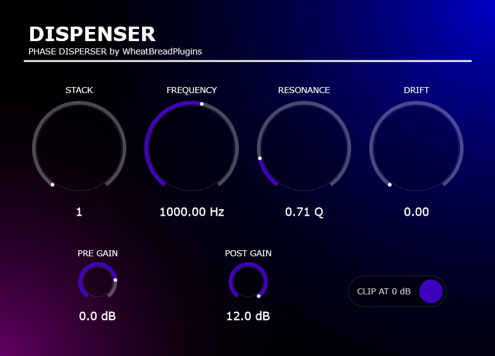

# Dispenser


Dispenser is a stereo phase disperser audio effect. It is built with JUCE and combines up to eight cascaded all-pass filter stages with optional input and output gain control.

The project currently produces a VST3 plug-in and a standalone application.




## Features

The filter core is optimized with AVX2: one 256-bit YMM register is treated as eight 32-bit lanes, allowing the eight filters to be calculated in parallel for each sample.

```text
YMM register (256-bit)
+---------+---------+---------+---------+---------+---------+---------+---------+
| Filter 1| Filter 2| Filter 3| Filter 4| Filter 5| Filter 6| Filter 7| Filter 8|
|  32-bit |  32-bit |  32-bit |  32-bit |  32-bit |  32-bit |  32-bit |  32-bit |
+---------+---------+---------+---------+---------+---------+---------+---------+
              -> eight filter stages calculated simultaneously
```

- Stereo audio effect with mono and stereo bus support
- Up to eight cascaded all-pass filter stages
- Per-sample parameter smoothing for smooth modulation and automation
- Per-stage frequency drift for a wider, less static response
- Pre- and post-processing gain controls
- Optional clipping at 0 dB
- Automatic plug-in state save and restore through JUCE's `AudioProcessorValueTreeState`
- Reported processing latency based on the selected stack size

## Controls

| Control | Range | Default | Description |
| --- | ---: | ---: | --- |
| Stack | 1-8 | 1 | Number of cascaded filter stages (Each stages have 8 filters)|
| Frequency | 40-20,000 Hz | 1,000 Hz | Main filter frequency |
| Resonance | 0.1-10.0 Q | 0.707 Q | Filter resonance |
| Drift | 0-1 | 0 | Amount of per-stage frequency variation |
| Pre Gain | -inf to +12 dB | 0 dB | Gain before the filter cascade |
| Post Gain | -inf to +12 dB | 0 dB | Gain after the filter cascade |
| Clip at 0 dB | Off/On | Off | Applies a hard clipper after post gain |

## Requirements

- CMake 3.28 or newer
- A C++23 compiler
- Git and network access on the first configure, so CMake can download JUCE 9.0.0
- A host or DAW that supports VST3 for plug-in use

The supplied configuration is primarily set up for Windows builds with MSVC or Clang-cl. Release builds enable AVX2 and compiler-specific optimizations.

## Building

### Pre-built VST3 and standalone binaries are available for Windows.

Configure the project with CMake from the repository root. The following example uses the Visual Studio 2022 generator:

```powershell
cmake -S . -B build -G "Visual Studio 18 2026" -A x64
cmake --build build --config Release
```

For a debug build:

```powershell
cmake --build build --config Debug
```

The generated files are placed under the build directory, normally in:

```text
build/Dispenser_artefacts/Release/VST3/
build/Dispenser_artefacts/Release/Standalone/
```

The exact output layout can vary slightly by generator and platform. `COPY_PLUGIN_AFTER_BUILD` is disabled, so the VST3 bundle is not automatically copied to a system plug-in directory.

## Project Layout

```text
Source/
  PluginProcessor.*       Audio processing and parameter state
  PluginEditor.*          Plug-in editor window
  Parameters/              Parameter identifiers and ranges
  DSP/                     All-pass filter, gain, and clipping processing
  GUI/                     Controls and custom JUCE look-and-feel
CMakeLists.txt             CMake and JUCE build configuration
```

## DSP Overview

The main signal path is:

```text
Input -> Pre Gain -> Cascaded All-Pass Filters -> Post Gain -> Optional Clipper -> Output
```

Each cascade contains eight available stages. The `Stack` control selects how many stages are active, while `Drift` applies a fixed, different frequency offset to each stage. The processor supports sample-rate-dependent frequency limiting and updates its reported latency when the stack size changes.

## License

For details, see the [LICENSE](LICENSE) file.
> [!NOTE]
> The JUCE library code used in this project is licensed under AGPLv3. 
> While my original code is provided under the MIT License, please be aware that many parts of it depend on the JUCE framework.
